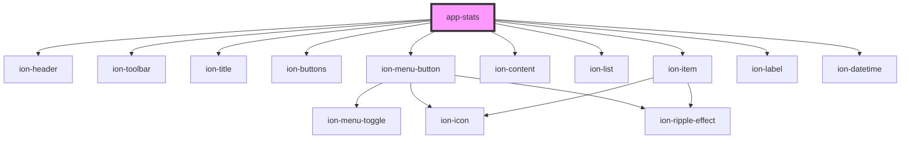

# app-stats

<!-- Auto Generated Below -->

## Dependencies

### Depends on

- ion-header
- ion-toolbar
- ion-title
- ion-buttons
- ion-menu-button
- ion-content
- ion-list
- ion-item
- ion-label
- ion-datetime

### Graph

----------------------------------------------

*Built with [StencilJS](https://stenciljs.com/)*
